# Career Transition Readiness & Bootcamp Reflections

<h1 align="center">Hi 👋 I'm Driss</h1>
<h3 align="center">MERN Stack Developer | E-commerce Enthusiast</h3>

## Readiness for Next Career Step

I feel **highly prepared** to take the next step in my career journey. The bootcamp has equipped me with both technical skills and the mindset needed to transition into a professional tech role. My confidence comes from:

- **Practical Project Experience**: Building full-stack applications from concept to deployment
- **Problem-Solving Muscle**: 400+ hours of coding challenges and debugging practice
- **Agile Methodology Fluency**: Experience working in sprint-based team projects
- **Portfolio Development**: 5+ production-ready projects demonstrating my capabilities

While I acknowledge there's always more to learn, I'm excited to apply my skills in a professional setting and grow through real-world challenges.

## Key Skills Gained During Bootcamp

### Technical Proficiencies

```mermaid
graph LR
A[Frontend] --> B(React · Zod · JavaScript ES6+)
A --> C(HTML5 · CSS3 · Responsive Design)
D[Backend] --> E(Node.js · Express)
D --> F(RESTful APIs · MongoDB)
G[DevOps] --> H(Git · GitHub · CI/CD)
```



```

```
